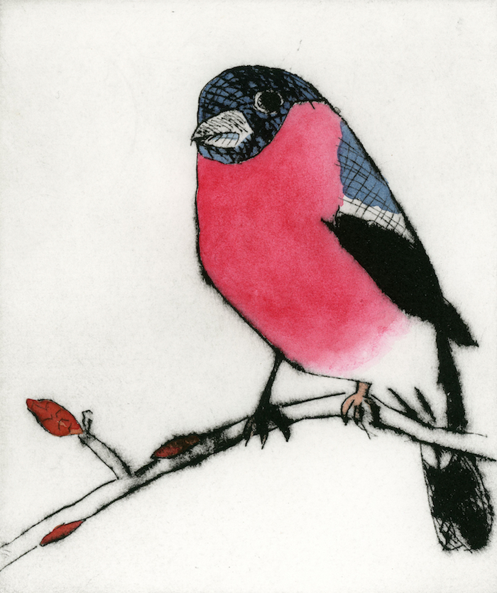
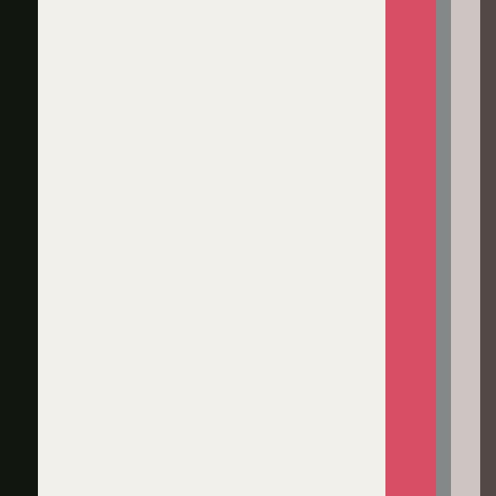

# 🎨 Art Palettes Bot 
A Twitter bot that uses K-means distribution to evaluate the six dominant colours from a work of art, and returns them
in the form of a palette of hexadecimal values

#### Original image

#### Art Palette
